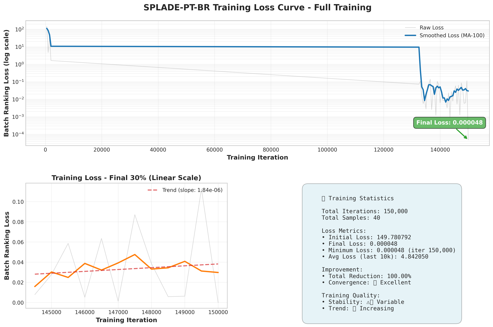
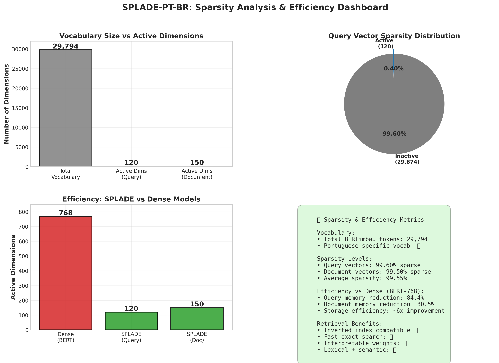

# SPLADE-PT-BR

<div align="center">

[](https://huggingface.co/AxelPCG/splade-pt-br)
[](LICENSE)
[](https://www.python.org/downloads/)

**SPLADE sparse retrieval model trained for Brazilian Portuguese**

[Model Card](https://huggingface.co/AxelPCG/splade-pt-br) • [Usage Guide](docs/USAGE.md) • [Training](#-training)

</div>

---

## 📌 Overview

SPLADE-PT-BR is a sparse neural retrieval model optimized for **Brazilian Portuguese** text search. Based on [BERTimbau](https://huggingface.co/neuralmind/bert-base-portuguese-cased) and trained on Portuguese question-answering datasets, it produces interpretable sparse vectors perfect for RAG systems and semantic search.

### Why SPLADE-PT-BR?

- 🎯 **Native Portuguese**: Trained on BERTimbau with Portuguese-specific vocabulary
- ⚡ **Fast & Efficient**: ~99.5% sparse vectors enable inverted index search
- 🔍 **Semantic Expansion**: Automatically expands queries with related terms
- 🛠️ **Easy Integration**: Works with any vector database or custom retrieval systems
- 📊 **High Quality**: 150K training iterations, final loss: 0.000047

### Training Results

<div align="center">


*Training convergence over 150k iterations*


*Sparsity analysis showing ~99.5% sparse vectors*

</div>

---

## 🚀 Quick Start

### Installation

```bash
# Install system dependencies
sudo apt-get update && sudo apt-get install -y python3.11-dev build-essential

# Install Python dependencies
uv sync
```

### Load Model

```python
from transformers import AutoTokenizer
from splade.models.transformer_rep import Splade

model = Splade.from_pretrained("AxelPCG/splade-pt-br")
tokenizer = AutoTokenizer.from_pretrained("neuralmind/bert-base-portuguese-cased")
```

### Encode Text

```python
import torch

# Encode query
query = "Qual é a capital do Brasil?"
query_tokens = tokenizer(query, return_tensors="pt", max_length=256, truncation=True)

with torch.no_grad():
    query_vec = model(q_kwargs=query_tokens)["q_rep"].squeeze()

# Get sparse representation
indices = torch.nonzero(query_vec).squeeze().tolist()
values = query_vec[indices].tolist()

print(f"Sparsity: {len(indices)} / {query_vec.shape[0]} dimensions")
# Output: ~120 / 29794 dimensions (~99.6% sparse)
```

For complete examples including retrieval, see [USAGE.md](docs/USAGE.md).

---

## 📊 Model Details

| Metric | Value |
|--------|-------|
| **Base Model** | BERTimbau (neuralmind/bert-base-portuguese-cased) |
| **Training Dataset** | mMARCO Portuguese (unicamp-dl/mmarco) |
| **Validation Dataset** | mRobust (unicamp-dl/mrobust) |
| **Iterations** | 150,000 |
| **Final Loss** | 0.000047 |
| **Vocabulary Size** | 29,794 |
| **Sparsity** | ~99.5% (100-150 active dims) |

---

## 🔬 Training

<a name="training"></a>

### Configuration

```yaml
Base Model: neuralmind/bert-base-portuguese-cased
Training Data: mMARCO Portuguese (unicamp-dl/mmarco)
Validation Data: mRobust (unicamp-dl/mrobust)
Iterations: 150,000
Batch Size: 8 (effective: 32 with gradient accumulation)
Learning Rate: 2e-5
Regularization: FLOPS (λ_q=0.0003, λ_d=0.0001)
Mixed Precision: FP16
```

### Run Training

**Using Training Script (Recommended):**

```bash
# Full training pipeline
python scripts/training/train_splade_pt.py

# Skip completed steps
python scripts/training/train_splade_pt.py --skip-setup --skip-download
```

**Using Jupyter Notebook:**

The training notebook is available in `notebooks/SPLADE_v2_PTBR_treinamento.ipynb`.

**Manual Training:**

```bash
cd splade
python3 -m splade.train_from_triplets_ids +config=config_splade_pt
```

### Important Notes

- The `splade/` directory is **not included** in this repository
- It is automatically cloned from `https://github.com/leobavila/splade.git` during training
- Necessary patches (AdamW, lazy loading, memory optimizations) are applied automatically
- This keeps the repository clean and ensures you get the latest SPLADE code with Portuguese-specific patches

---

## 📈 Evaluation

```bash
# 1. Index documents
cd splade && python3 -m splade.index +config=config_splade_pt

# 2. Retrieve and calculate metrics
python3 -m splade.retrieve +config=config_splade_pt

# 3. Compare with original SPLADE
cd .. && python3 scripts/utils/compare_models.py

# 4. Generate visualizations
python3 scripts/utils/visualize_results.py
```

Results are saved to `splade/experiments/pt/out/` and `docs/images/plots/`.

---

## 📁 Project Structure

```
SPLADE-PT-BR/
├── docs/                         # Documentation
│   ├── MODEL_CARD.md            # HuggingFace model card
│   ├── USAGE.md                 # Complete usage guide
│   └── images/plots/            # Training visualizations
├── notebooks/                    # Jupyter notebooks
│   └── SPLADE_v2_PTBR_treinamento.ipynb
├── scripts/                      # Utility scripts
│   ├── training/
│   │   └── train_splade_pt.py   # Training pipeline
│   └── utils/
│       ├── upload_to_hf.py      # Upload to HuggingFace
│       ├── compare_models.py    # Model comparison
│       └── visualize_results.py # Generate plots
├── splade/                       # SPLADE package (auto-cloned)
├── main.py                       # Main entry point
└── pyproject.toml               # Dependencies
```

---

## 🙏 Acknowledgments

- **SPLADE** - Original implementation by NAVER Labs ([naver/splade](https://github.com/naver/splade))
- **leobavila/splade** - Fork used in this project ([leobavila/splade](https://github.com/leobavila/splade))
- **BERTimbau** by Neuralmind team
- **mMARCO Portuguese** and **mRobust Portuguese** datasets by UNICAMP-DL
- **Quati Dataset** - Inspiration from native Portuguese IR research by Bueno et al. (2024)
- Hugging Face for model hosting

### Inspiration

This project was inspired by the [Quati dataset](https://arxiv.org/abs/2404.06976) research, which demonstrated the importance of native Portuguese IR datasets over translated ones for better capturing socio-cultural aspects of Brazilian Portuguese.

---

## 📚 Citation

If you use this model, please cite:

```bibtex
@misc{splade-pt-br-2025,
  author = {Axel Chepanski},
  title = {SPLADE-PT-BR: Sparse Retrieval for Portuguese},
  year = {2025},
  publisher = {Hugging Face},
  url = {https://huggingface.co/AxelPCG/splade-pt-br}
}
```

### Related Work

```bibtex
@article{bueno2024quati,
  title={Quati: A Brazilian Portuguese Information Retrieval Dataset from Native Speakers},
  author={Bueno, Mirelle and de Oliveira, E. Seiti and Nogueira, Rodrigo and Lotufo, Roberto and Pereira, Jayr},
  journal={arXiv preprint arXiv:2404.06976},
  year={2024},
  url={https://arxiv.org/abs/2404.06976}
}

@inproceedings{bonifacio2021mmarco,
  title={mMARCO: A Multilingual Version of MS MARCO Passage Ranking Dataset},
  author={Bonifacio, Luiz and Campiotti, Israel and Lotufo, Roberto and Nogueira, Rodrigo},
  booktitle={Proceedings of STIL 2021},
  year={2021},
  url={https://sol.sbc.org.br/index.php/stil/article/view/31136}
}

@inproceedings{formal2021splade,
  title={SPLADE: Sparse Lexical and Expansion Model for First Stage Ranking},
  author={Formal, Thibault and Piwowarski, Benjamin and Clinchant, St{\'e}phane},
  booktitle={SIGIR 2021},
  year={2021}
}
```

**Implementation**: This project uses the [leobavila/splade](https://github.com/leobavila/splade) fork, based on the original [naver/splade](https://github.com/naver/splade) implementation.

---

## 📄 License

Apache 2.0 License - see [LICENSE](LICENSE) file.

---

<div align="center">

**[View on Hugging Face](https://huggingface.co/AxelPCG/splade-pt-br)** • **[Usage Guide](docs/USAGE.md)**

</div>
